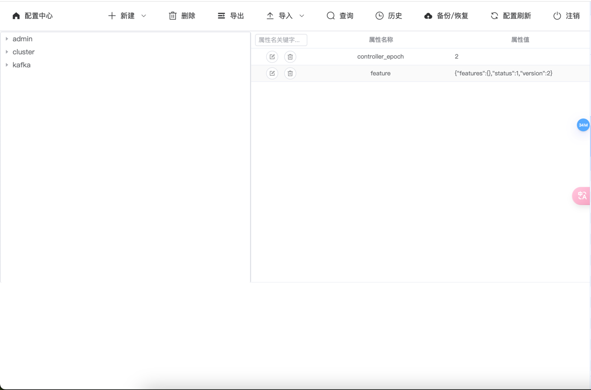

## 1.组件说明

​	目前主流的开源配置中心有：`SpringCloud Config`、`Nacos`、`Apollo`、`Disconf`，都是比较优秀的开源方案，为啥还要搞一个出来，主要原因为2个方面吧：首先`zk`本身的机制就支持集群部署保证了配置服务的可用性和安全性，可以将`zk`作为数据存储介质，另外也方便日后有特殊的需求能自行进行扩展实现。


## 2.Dashboard




## 3.安装部署

- 安装部署(需依赖部署zookeeper)

```bash
git clone https://github.com/hbq969/zkc.git
cd zkc/src/main/resources/static
nvm use 20
npm install && npm run build
cd -
mvn springboot:run
```

- 本地运行

> http://localhost:30141

```
cd zkc/src/main/resources/static
nvm use 20
npm run serve
```


## 4.配置使用

- 依赖

```
<dependency>
  <groupId>org.springframework.cloud</groupId>
  <artifactId>spring-cloud-starter-zookeeper-config</artifactId>
</dependency>
<dependency>
  <groupId>org.apache.zookeeper</groupId>
  <artifactId>zookeeper</artifactId>
  <version>3.6.2</version>
</dependency>
```


- 接入配置中心

> src/main/resources/bootstrap.properties

```
spring.application.name=demo
spring.cloud.zookeeper.enabled=true
spring.cloud.zookeeper.connect-string=localhost:2181
spring.cloud.zookeeper.config.root=/com/github/hbq
spring.cloud.zookeeper.config.watcher.enabled=false
spring.cloud.zookeeper.config.defaultContext=common
spring.cloud.zookeeper.config.profileSeparator=,
spring.cloud.zookeeper.auth.schema=digest
spring.cloud.zookeeper.auth.info=zk密码
```

